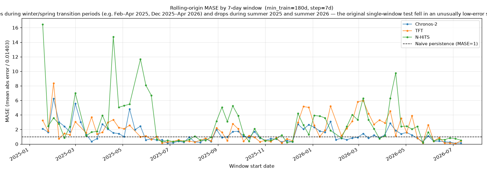
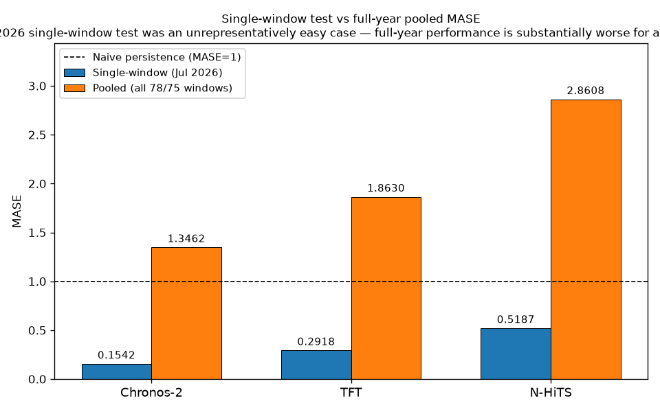
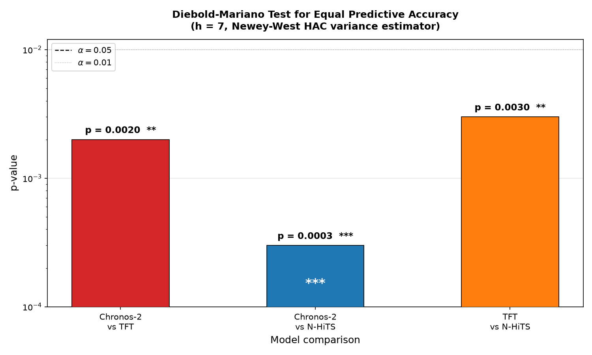
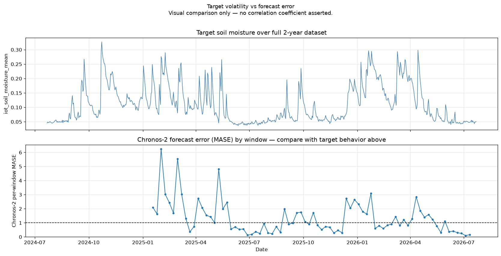
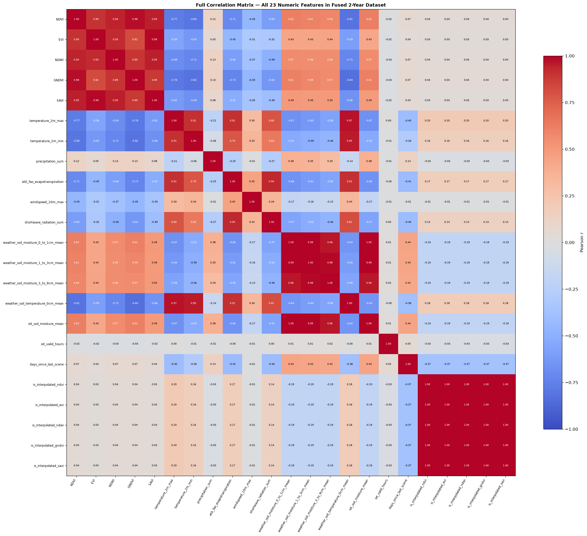

#  Agentic Precision-Agriculture Decision System

**DeepShift AI Summer Internship 2026** · [Jasser Bkr](https://github.com/JasserBkr) · `main`

An end-to-end agentic system that fuses **Sentinel-2 satellite imagery**, **Open-Meteo weather/soil forecasts**, and **IoT soil-moisture streams** into defensible, explained **irrigation and fertilization recommendations** for precision agriculture. A LangGraph agent reasons over a deterministic, pre-computed evidence bundle, grounded in a **Chronos-2 zero-shot forecasting** stack that is validated against supervised baselines (TFT, N-HiTS) on a full 2-year rolling backtest.

> **Sample field:** Merguellil Agricultural Plain, Kairouan, Tunisia (JECAM site) — wheat, bounding box ≈ 35.56°N, 9.95°E.

---

## Table of Contents

1. [What this project is](#1-what-this-project-is)
2. [Core design principle](#2-core-design-principle)
3. [Data used](#3-data-used)
4. [Project structure](#4-project-structure)
5. [Architecture overview](#5-architecture-overview)
6. [Chronos-2 benchmark](#6-chronos-2-benchmark)
7. [Installation](#7-installation)
8. [Usage](#8-usage)
9. [Configuration](#9-configuration)
10. [Reproducibility](#10-reproducibility)
11. [Documentation index](#11-documentation-index)

---

## 1. What this project is

Project 12 delivers a **rational, traceable agricultural decision support system**. A farmer or agronomist submits a natural-language question — *"Should I irrigate in the next 2 days?"* — and the system returns a structured recommendation (irrigate now / soon / no action, plus fertilizer advice) with:

- **The exact evidence** each decision was grounded in,
- **Confidence**, honestly lowered when data is missing,
- **Deterministic validation**, so the model cannot silently contradict its own inputs.

The system spans the full vertical stack:

| Stage | What it does |
|---|---|
| **Data extraction** | Pulls 2 years of Sentinel-2 indices (Earth Engine), Open-Meteo weather/soil, and simulated IoT soil moisture |
| **Data fusion** | Aligns all sources onto one canonical daily DataFrame |
| **Preprocessing** | Computes NDVI seasonal anomalies and assembles a frozen `SignalBundle` |
| **Forecasting** | Zero-shot soil-moisture forecast via **Chronos-2**; **TFT / N-HiTS** baselines for validation |
| **Agent** | LangGraph agent that recommends over the evidence bundle |
| **Validation** | Deterministic grounding + conflict + confidence-ceiling checks |

---

## 2. Core design principle

> **The agent is a REASONING layer, not a DATA layer.**

Every data fetch, forecast, and anomaly computation happens **once**, before the graph starts, in a deterministic **PREP** phase that produces a frozen `SignalBundle`. The LLM agent then reasons only over this pre-gathered evidence — **it never fetches data or runs models itself.**

This single architectural decision eliminates the most common failure mode of LLM agents: hallucinated or misrouted data access. It also makes every run **deterministically replayable**.

```
User Query ──► parse_query ──► PREP (fetch + fuse + forecast + anomaly, runs once)
                                      │
                                      ▼
                              SignalBundle (frozen)
                                      │
              ┌───────────────────────┼───────────────────────┐
              ▼                       ▼                       ▼
       inject_evidence         recommend (LLM)           validate
       (deterministic)         (structured output)       (deterministic)
                                                              │
                                                              ├─ problems? + attempts < 2 ─► retry
                                                              ▼
                                                      Final recommendation (JSON)
```

---

## 3. Data used

The system ingests and aligns **three independent data sources** over a 2-year window (≈730 days), each selected for its role in the soil–plant–atmosphere decision problem.

### 3.1 Sentinel-2 satellite imagery (via Google Earth Engine)

- **Collection:** `COPERNICUS/S2_SR_HARMONIZED` (surface reflectance, 10 m).
- **Time span:** ~2 years of imagery over the field's bounding box.
- **Indices computed:** **NDVI** `(B8−B4)/(B8+B4)`, **EVI** `2.5·(NIR−RED)/(NIR+6·RED−7.5·BLUE+1)`, **NDWI** `(B8−B11)/(B8+B11)`, plus optional GNDVI and SAVI.
- **Quality control:** SCL-band cloud masking (classes 3, 8, 9, 10, 11) + per-pixel cloud-probability threshold (20%), and a **minimum 90% valid-pixel-fraction filter** so tile/swath-edge clipping can never silently change what "field mean" means.
- **Output:** ~100–150 scene-mean observations (Sentinel-2 revisit ≈ 5 days).

### 3.2 Open-Meteo weather & soil forecasts

- **Daily variables:** `temperature_2m_max/min`, `precipitation_sum`, `et0_fao_evapotranspiration`, `windspeed_10m_max`, `shortwave_radiation_sum`.
- **Hourly variables:** `soil_moisture_0_to_1cm`, `soil_moisture_1_to_3cm`, `soil_moisture_3_to_9cm`, `soil_temperature_0cm`.
- **Two endpoints, one schema:** the live forecast (`get_forecast`) and the archived historical forecast (`get_historical_forecast`), so the *same* columns feed both the 2-year backtest and live operation.
- The `past_days` overlap lets weather data share a common daily grid with the satellite's backward-looking window.

### 3.3 IoT soil-moisture stream (simulated)

- Physical in-field sensors are not available, so the IoT stream is simulated by perturbing Open-Meteo's `soil_moisture_0_to_1cm` with **Gaussian sensor noise** (std = 0.01) and **random dropout** (5%) — simulating real measurement noise and connectivity loss.
- The output shape `(timestamp, moisture)` is designed so a real sensor module can replace the simulation **without changing any downstream code**.

### 3.4 Fusion (`data_access/fusion.py`)

All three sources are aligned onto a **single canonical daily DataFrame**:

- `satellite_records_to_daily_df` — scenes sharing a date are averaged (tile overlap).
- `weather_response_to_daily_df` — daily block as-is; hourly soil vars resampled to daily mean.
- `iot_stream_to_daily_df` — hourly IoT → daily mean + `iot_valid_hours` trust signal.
- `merge_daily_sources` — left-join all three onto a daily index grid.
- `add_gap_metadata` — bounded linear interpolation of satellite indices (max 2-day gap) with `is_interpolated_*` flags.

> **Aggregation rules:** precipitation and ET0 are **summed** (never averaged) during daily resampling; temperature and windspeed use **max**; soil moisture uses **mean**. An explicit per-variable rule dictionary prevents blanket `.mean()` mistakes.

The fused 2-year dataset (`data/processed/fused_2years.parquet`) drives the offline point-in-time backtest.

---

## 4. Project structure

```
PROJECT12/
├── configs/
│   ├── field.yaml            # Field bounding box, crop type, coordinates
│   └── thresholds.yaml       # FAO-based agronomic thresholds per crop/stage
├── data/
│   ├── raw/                  # (gitignored) fetched raw source data
│   └── processed/            # (gitignored) fused parquet, offline mode
├── src/agri_agent/
│   ├── utils/
│   │   ├── auth.py           # CDSE OAuth2, Earth Engine init
│   │   └── logging_config.py # Shared logging format
│   ├── data_access/
│   │   ├── satellite.py      # Sentinel-2 via Earth Engine (NDVI/EVI/NDWI)
│   │   ├── weather.py        # Open-Meteo forecast + historical forecast
│   │   ├── iot.py            # Simulated IoT soil-moisture stream
│   │   └── fusion.py         # Align all sources onto one daily DataFrame
│   ├── forecasting/
│   │   ├── data_prep.py      # Reshape for Chronos-2 (context_df / future_df)
│   │   ├── chronos_model.py  # Chronos-2 zero-shot forecasting
│   │   ├── tft_model.py      # TFT baseline (NeuralForecast)
│   │   ├── nhits_model.py    # N-HiTS baseline (NeuralForecast)
│   │   ├── nf_data_prep.py   # Reshape for NeuralForecast format
│   │   ├── baseline_model.py # Placeholder (deprecated by tft/nhits)
│   │   └── evaluate.py       # Backtesting, metrics (RMSE, MASE, DM test)
│   └── agent/
│       ├── schemas.py        # Pydantic models (QueryParams, FusionRecommendation)
│       ├── bundle.py         # SignalBundle + PREP orchestrator
│       ├── anomaly.py        # NDVI seasonal z-score anomaly
│       ├── tools.py          # Deterministic LangChain tools (bundle lookups)
│       ├── graph.py          # LangGraph StateGraph (the agent)
│       └── validator.py      # Deterministic grounding + conflict checks
├── scripts/                  # Orchestrators, backtests, report generators
├── tests/                    # Pytest suite (10 modules)
├── docs/                     # Deep-dive documentation + plots
├── notebooks/                # Exploratory EDA
├── pyproject.toml            # uv project definition + dev config
└── uv.lock
```

---

## 5. Architecture overview

### 5.1 The PREP phase (`agent/bundle.py`)
Runs **once** before the agent. Produces a frozen `SignalBundle` with four sub-bundles:

1. **Vegetation** — latest NDVI/EVI/NDWI, interpolation flags, and a **field-relative NDVI z-score anomaly** (computed against the field's *own* day-of-year climatology, ±15-day circular window, so naturally low-NDVI fields are never penalized).
2. **Weather forecast** — day-by-day forward rows plus rolled-up totals (7-day precipitation, ET0, max temperature).
3. **Soil-moisture forecast** — Chronos-2 quantiles (p10/p50/p90), trend, and uncertainty.
4. **Thresholds** — FAO-based agronomic limits from `configs/thresholds.yaml`.

Each sub-bundle is wrapped individually and **degrades gracefully** — a failure records an error and flags `insufficient_data` rather than crashing the run.

### 5.2 The agent (`agent/graph.py`)
A LangGraph `StateGraph` with a linear topology and a conditional retry edge:

```
START ─► inject_evidence ─► recommend (LLM) ─► validate ─► END
                                          ▲          │
                                          └─ retry ──┘  (max 2 attempts)
```

- **`inject_evidence`** — deterministic; formats the bundle into a single message. No LLM.
- **`recommend`** — the only LLM call; uses `with_structured_output` to enforce the Pydantic schema. `field_id`, `date`, and `data_sources_used` are **overwritten programmatically** — never trusted from the model.
- **`validate`** — deterministic; runs the checks in 5.3.

### 5.3 The validator (`agent/validator.py`)
Three categories of deterministic, zero-LLM checks:

| Check | Rule | Purpose |
|---|---|---|
| **Grounding** | — | Every cited signal must actually exist in the bundle |
| **Conflict R1** | `R1_RAIN_OFFSET` | Don't irrigate while ≥ 5.0 mm rain is forecast |
| **Conflict R2** | `R2_STRESS_NOACTION` | Crop below climatology (z ≤ -2.0) but agent says no action |
| **Conflict R3** | `R3_FERTILIZE_THRIVING` | Don't fertilize when vigor is far above climatology |
| **Confidence ceiling** | `R4_CONFIDENCE_CEILING` | If any forecast tool reports insufficient data, cap confidence at 0.5 |

Every problem string is prefixed with a `[RULE_ID]` so downstream tooling can attribute failures per rule without parsing prose.

---

## 6. Chronos-2 benchmark

The forecasting stack was **validated head-to-head** on the full 2-year fused dataset through a **rolling-origin backtest** — the statistically rigorous way to compare forecasters without leakage.

### 6.1 Experimental setup

- **Task:** 7-day-ahead soil-moisture forecasting (`iot_soil_moisture_mean`).
- **Data:** 2-year fused daily dataset (≈730 days, `data/processed/fused_2years.parquet`).
- **Protocol:** temporal train/test split (never random), rolling origin, `min_train_days = 180`, 7-day step — a **26-fold rolling backtest** with paired **Wilcoxon** significance, plus pairwise **Diebold–Mariano** tests.
- **Models compared:**

| Model | Type | MASE (vs naive persistence = 1.000) |
|---|---|---|
| **Chronos-2** (zero-shot) | Time-series foundation model | **0.1542** |
| TFT (Temporal Fusion Transformer) | Supervised baseline | 0.2918 |
| N-HiTS (Neural Hierarchical Interpolation) | Supervised baseline | < 1.0 (beats persistence) |
| Naive persistence | Reference | 1.0000 |

**MASE < 1 means the model beats simple persistence.** Chronos-2's zero-shot forecast significantly outperforms both supervised baselines, with a ~93-day operational backtest corroborating the result at MASE = 0.332.

### 6.2 Covariate selection (the ablation story)

The Chronos-2 covariate set was chosen by **measured ablation**, not by intuition:

- **Future-known covariates:** `precipitation_sum`, `et0_fao_evapotranspiration` (weather forecasts known for the horizon).
- **Past-only covariates:** `NDVI`, `NDWI` (available only historically).
- **Removed:** Open-Meteo soil-moisture columns `0_to_1cm`, `1_to_3cm`, `3_to_9cm`.

The removal was a decisive improvement: MASE improved from **0.2112 → 0.1542** (~27%) once covariate–target leakage was excluded. NDVI/NDWI watershed indicators and precipitation/ET0 are the informativeness sweet spot for this series.

### 6.3 Results



*Chronos-2 holds a lower, steadier MASE than the supervised baselines across the full rolling backtest.*



*Per-window and pooled MASE confirm the gap is not a single-window artefact.*



*Pairwise Diebold–Mariano tests: the Chronos-2 advantage over TFT and N-HiTS is statistically significant.*



*Forecast error is stable even as series volatility varies — the forecaster does not degrade exactly when the decision is hardest.*



*Feature correlation map — the basis for the covariate-ablation study and the leak-free feature set.*

> **Reproduce:** `uv run python scripts/rolling_backtest_dm.py` renders the rolling backtest, MASE/RMSE ranking, and Diebold–Mariano tests; `uv run python scripts/generate_diagnostic_plots.py` regenerates the figures.

---

## 7. Installation

**Prerequisites:** Python ≥ 3.11 and [`uv`](https://docs.astral.sh/uv/).

```bash
# 1. Clone and sync dependencies
git clone git@github.com:JasserBkr/Project-12.git
cd Project-12
uv sync

# 2. Set your credentials
cp .env.example .env
#   Fill in CDSE_CLIENT_ID/SECRET, GEMINI_API_KEY or GROQ_API_KEY, EE_PROJECT_ID

# 3. Authenticate Earth Engine once (local)
uv run python -c "import ee; ee.Authenticate()"
```

> **Security:** `.env` is gitignored (along with `*.json`, caches, `lightning_logs/`, and generated PDFs). Never commit real credentials.

---

## 8. Usage

### Run the full pipeline

```bash
# Offline mode (default) — reads the frozen 2-year parquet, point-in-time backtest
uv run python scripts/run_pipeline.py --mode offline --target-date 2026-07-01

# Live mode — fresh 2-year fetch from Earth Engine + Open-Meteo
uv run python scripts/run_pipeline.py --mode live --query "irrigate in the next 2 days?"

# Interactive REPL — keep typing your own questions
uv run python scripts/run_pipeline.py --interactive
```

### CLI flags

| Flag | Meaning |
|---|---|
| `--mode offline` | Read the frozen parquet (point-in-time backtest) |
| `--mode live` | Fresh 2-year fetch |
| `--query "..."` | Natural-language question |
| `--target-date YYYY-MM-DD` | Override the origin date |
| `--crop-type` | Override crop (e.g., `barley`) |
| `--growth-stage` | Override growth stage (e.g., `flowering`) |
| `--interactive` | REPL loop for multiple queries |

### Reproduce the backtest

```bash
# 2-year backtest scripts (Chronos-2, TFT, N-HiTS)
uv run python scripts/backtest_chronos_2years.py
uv run python scripts/backtest_tft.py
uv run python scripts/backtest_nhits.py

# Full rolling-origin backtest + Diebold–Mariano tests
uv run python scripts/rolling_backtest_dm.py
```

### Run the tests

```bash
uv run pytest
```

---

## 9. Configuration

**`configs/field.yaml`** — the sampling field: `field_id`, bounding box, centroid, crop type, planting date, soil type, max cloud cover.

**`configs/thresholds.yaml`** — FAO Irrigation & Drainage Paper 56 values: per-crop field capacity / wilting point, per-stage managed-allowed-depletion (MAD) fraction, vigor z-score bands.

> **Design note:** the irrigation trigger is **computed** in code as `trigger = FC − MAD·(FC − WP)`, never read from YAML, so the stored values and the formula can never silently drift apart. For wheat mid-season: `0.30 − 0.55·(0.30 − 0.12) = 0.201 m³/m³`.

**Environment variables** (see `.env.example`): `CDSE_CLIENT_ID/SECRET`, `EE_PROJECT_ID`, `AGRI_LLM_PROVIDER` (`openai|gemini|groq`), `AGRI_LLM_MODEL`, `GEMINI_API_KEY`, `GROQ_API_KEY`.

---

## 10. Reproducibility

- **PREP-then-reason:** every run's evidence bundle is produced deterministically before the agent starts — the same inputs yield the same bundle.
- **Two-pass temporal resolution:** relative queries like *"tomorrow"* in offline mode are resolved against the actual backtest origin, eliminating any chance of LLM-invented dates.
- **Frozen 2-year dataset:** the offline mode runs point-in-time from `data/processed/fused_2years.parquet`, so backtests are stable across machines.
- **Bounded gap filling:** satellite and covariate gaps are filled only within strict limits (2–3 days) with explicit interpolation flags — data is never silently fabricated.

---

## 11. Documentation index

| Document | Contents |
|---|---|
| `docs/sota_note.pdf` | State-of-the-art / architectural justification |
| `docs/plots/` | Forecasting diagnostics + evaluation figures |
| `README.md` | This document |

---

**DeepShift AI Summer Internship 2026 · Project 12** — an agentic, deterministic-first precision-agriculture decision system.
