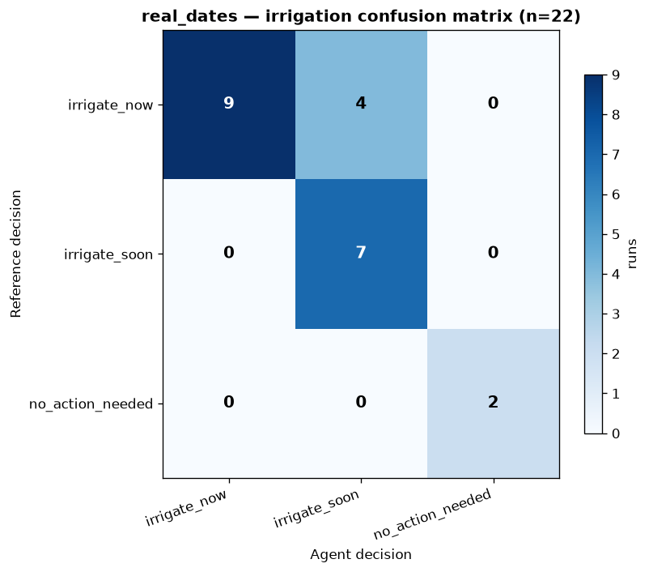
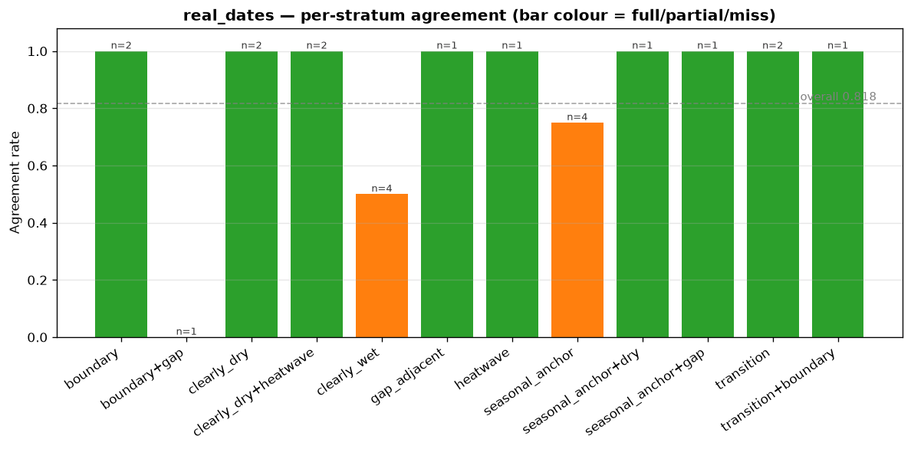
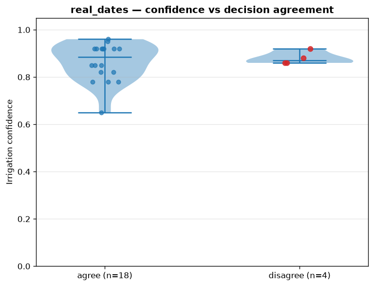
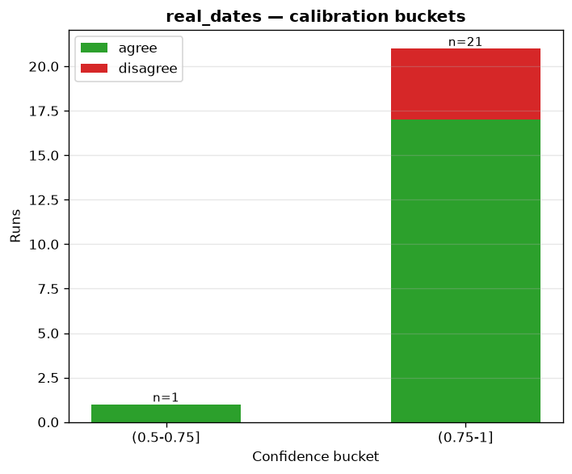
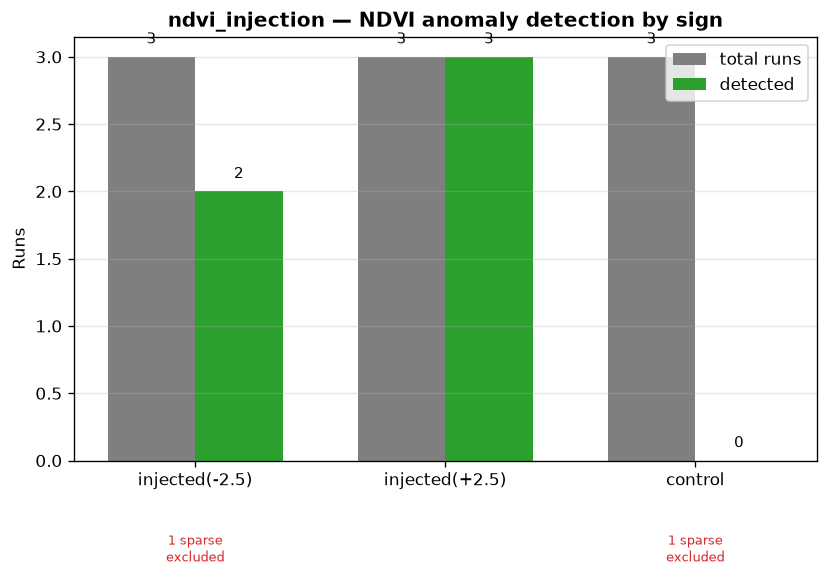
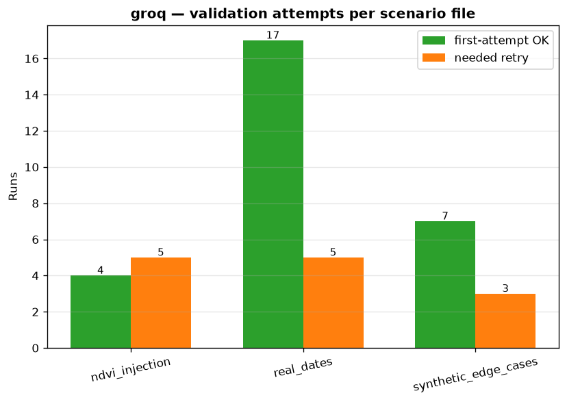
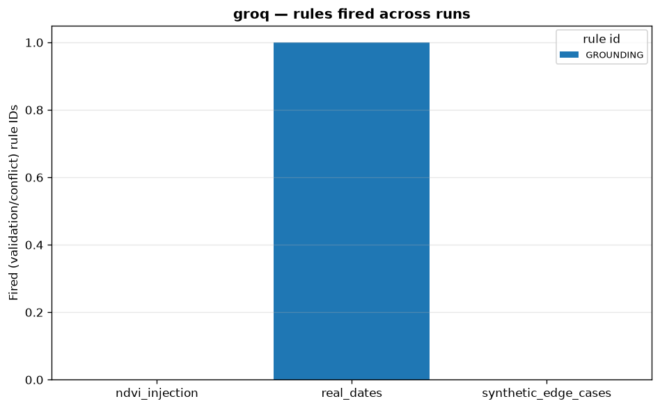
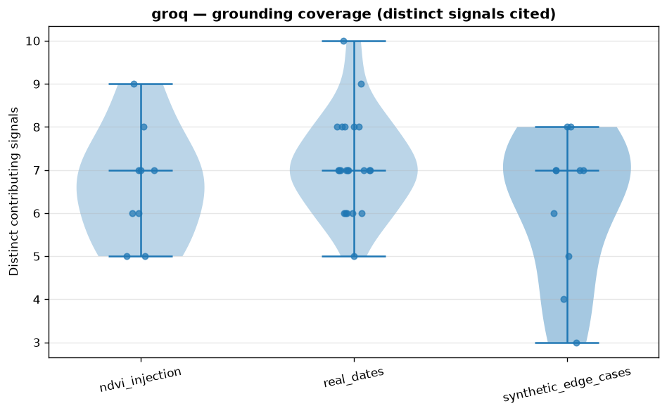
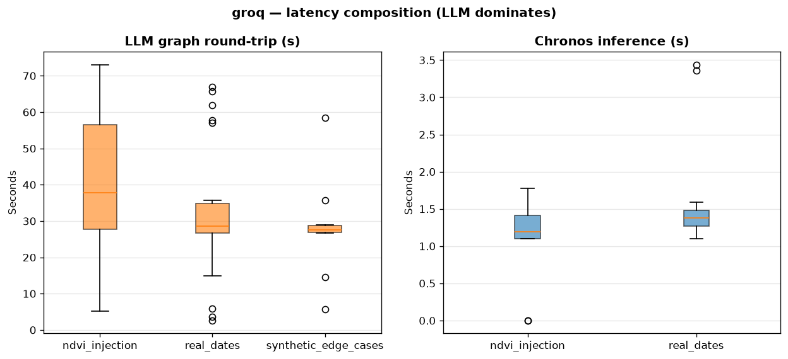
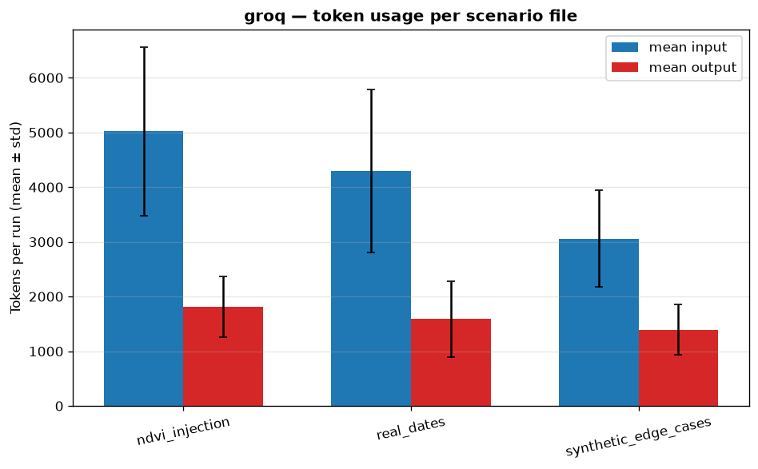

# Agent Evaluation Report — Groq

_Campaign `sweep-20260823`, provider `groq`. Gemini and fake-provider runs excluded from this document by design._

**Scope:** 41 scored runs — `real_dates` (22), `synthetic_edge_cases` (10), `ndvi_injection` (9). Single field (Kairouan, `field_merguellil_01`). 
**Source:** raw JSONL in `evaluation/results/sweep-20260823/groq/`. Regenerate the report with `uv run python -m evaluation.metrics.eval_report` and the plots with `uv run python -m evaluation.metrics.plots`.

## Executive summary

- **Layer 2 (decisions, 22 real runs):** 3-class agreement **82%**; collapsed 2-class agreement **100%** (no decision missed on the do/don't-irrigate axis). All **4/4 boundary cases** agreed — the regime that separates calibrated from lucky agents.

- **Layer 2b (NDVI anomalies):** precision **1.0**, recall **1.0** (band errors the anomaly detector is excluded from), controls **0.0** FP.

- **Layer 3 (behaviour):** **0.0** schema failures; first-attempt grounding **77%**; 1/22 runs ended on an unsupported `GROUNDING` claim after retry. Synthetic expected-checks **5/5** pass; generic-default trap **pass**.

- **Layer 4 (ops):** LLM graph round-trip dominates every run (mean **32.62s** vs Chronos **1.54s**); mean **1.23** LLM calls/run vs a cached cap of **3** (no tool loop). Real-dates soil-insufficient rate **0.0** → Layer-2 denominators intact.

- **Verdict:** Groq is operationally viable and behaviourally clean for this campaign. Two strata are the review targets for the next sweep: `clearly_wet` (agreement 50%) and `boundary+gap` (0%).

## Layer 2 — Irrigation decision quality (real_dates)

Ground truth is `reference_policy.py` — an independent scorer that shares no code path with the agent's validator. `UNDECIDED` reference cases are excluded from denominators and counted separately.

| | |
|---|---|
| n_scored | `22` |
| n_undecided_ref | `0` |
| agreement_3class | `0.818` |
| agreement_2class | `1.0` |
| confusion_matrix | `{"irrigate_now": {"irrigate_now": 9, "irrigate_soon": 4}, "irrigate_soon": {"irrigate_soon": 7}, "no_action_needed": {"no_action_needed": 2}}` |
| boundary_cases | `{"n": 4, "agree": 4, "rate": 1.0}` |
| confidence_mean_agree | `0.863` |
| confidence_mean_disagree | `0.88` |
| calibration_buckets | `{"(0.75-1]": {"n_agree": 17, "n_disagree": 4}, "(0.5-0.75]": {"n_agree": 1, "n_disagree": 0}}` |
| per_stratum | `{"boundary": {"n": 2, "agreement": 1.0}, "boundary+gap": {"n": 1, "agreement": 0.0}, "clearly_dry": {"n": 2, "agreement": 1.0}, "clearly_dry+heatwave": {"n": 2, "agreement": 1.0}, "clearly_wet": {"n": 4, "agreement": 0.5}, "gap_adjacent": {"n": 1, "agreement": 1.0}, "heatwave": {"n": 1, "agreement": 1.0}, "seasonal_anchor": {"n": 4, "agreement": 0.75}, "seasonal_anchor+dry": {"n": 1, "agreement": 1.0}, "seasonal_anchor+gap": {"n": 1, "agreement": 1.0}, "transition": {"n": 2, "agreement": 1.0}, "transition+boundary": {"n": 1, "agreement": 1.0}}` |
| fertilization_caveat_rate | `0.0` |
| fertilization_vs_ndvi_z_spearman_DESCRIPTIVE_ONLY | `{"rho": -0.327, "p": 0.1376, "n": 22}` |

_(Reference × agent confusion matrix)_

_(Per-stratum agreement (green = all correct, orange = partial, red = miss))_

**Reading:**

- **Boundary regime (`n=4`)** at ≤0.02 m³/m³ from the trigger: agreement **100%** — the agent does not lose the decision exactly where it matters most.

- All 4 disagreements are `irrigate_now` (reference) vs `irrigate_soon` (agent) — a timing gap, **not** a no-action failure, which is why collapsed 2-class reaches 1.0.

- **Confidence is not yet a reliable honesty signal:** mean confidence on agreeing runs is 0.86 vs 0.88 on disagreements — the agent is on average as confident when wrong as when right.

- **`clearly_wet` (50%, n=4) and `boundary+gap` (0%, n=1)** are the two strata to pressure-test next; the `seasonal_anchor` 0.75 miss is a single run.

- Fertilization behaviour is **descriptive-only**: Spearman(apply_fertilizer, ndvi_z) = -0.327 (p=0.1376, n=22) — reported for transparency, not a scored target.

_(Confidence distribution, agreed vs disagreed decisions)_

_(Agree/disagree per confidence bucket)_

## Layer 2b — NDVI anomaly detection (ndvi_injection)

Deterministic PREP-band detection scored over injected ±2.5σ anomalies plus clean controls. Origins whose history is too data-sparse for the detector are listed by name, never silently counted as misses.

| | |
|---|---|
| precision_anomaly_band | `1.0` |
| recall_anomaly_band | `1.0` |
| false_positive_rate_controls | `0.0` |
| by_sign | `{"stress(-2.5)": {"n": 2, "detected": 2}, "vigor(+2.5)": {"n": 3, "detected": 3}}` |
| recovery_error_mean_abs | `0.257` |
| sparse_origins_excluded | `["groq:ndvi_injection:inj-neg-1", "groq:ndvi_injection:ctrl-1"]` |

_(Anomaly detection by sign: grey = total runs, green = detected)_

**Reading:** band precision/recall **1.0**/**1.0**, **0.0** false positives from 5 injections. Mean recovery error is **0.257σ** — the detector lands its estimate ±0.26σ of the injected magnitude. Data-sparse exclusions: `inj-neg-1`, `ctrl-1`.

## Layer 3 — Agent behaviour & reliability

All 41 runs produced parseable structured output (schema-failure rate 0.0 everywhere). The grounding proxy is the share of runs that passed the validator on the **first** attempt; `retry_recovery_rate` is retries that fixed the problem, and `unsupported_claims_after_retry` is the residue the validator never accepted.

| metric | real_dates | synthetic | ndvi_injection |
|---|---|---|---|

| schema_structured_output_failure_rate | 0.0 | 0.0 | 0.0 |

| grounding_first_attempt_proxy_rate | 0.773 | 0.7 | 0.444 |

| retry_rate | 0.227 | 0.3 | 0.556 |

| retry_recovery_rate | 0.8 | 1.0 | 1.0 |

| unsupported_claims_after_retry_rate | 0.2 | 0.0 | 0.0 |

| signal_conflict_detected_rate | 0.045 | 0.0 | 0.0 |

| contributing_signal_coverage (distinct) | 7.14 | 6.2 | 6.67 |

_(First-attempt vs retry by scenario file)_

_(Validator/conflict rule IDs fired)_

_(Distinct contributing signals cited per run)_

**Reading:** manually-guided (non-agent) injection runs need retries most (56%) and recover all of it; one `real_dates` run persisted a `GROUNDING` violation (`unsupported_claims_after_retry 0.2`), and it is the only `signal_conflict_detected` run. NDVI-injection runs fall into the grounding-is-honest-about-data pattern: more retries, full recovery. Synthetic expected-checks: **5/5** pass, generic-default trap **pass**.

## Layer 4 — Operational viability (free-tier quotas)

Latency split measures Chronos inference separately from the LLM graph round-trip. The theoretical call ceiling is 3 (parse + up to 2 recommend attempts) — there is **no tool loop**, so quota usage is bounded.

| metric | real_dates | synthetic | ndvi_injection |
|---|---|---|---|

| latency_chronos_s | `{"mean": 1.54, "median": 1.39, "p95": 3.36, "max": 3.439}` | `null` | `{"mean": 1.03, "median": 1.193, "p95": 1.776, "max": 1.776}` |

| latency_graph_llm_s | `{"mean": 32.62, "median": 28.616, "p95": 65.7, "max": 66.869}` | `{"mean": 28.07, "median": 27.791, "p95": 58.408, "max": 58.408}` | `{"mean": 42.45, "median": 37.717, "p95": 73.098, "max": 73.098}` |

| llm_calls_per_run | `{"mean": 1.23, "max": 2, "theoretical_ceiling": 3}` | `{"mean": 1.3, "max": 2, "theoretical_ceiling": 3}` | `{"mean": 1.56, "max": 2, "theoretical_ceiling": 3}` |

| tokens_input_total | `94443` | `30607` | `45188` |

| tokens_output_total | `34936` | `13932` | `16285` |

| tokens_per_run_mean_in_out | `[4292.9, 1588.0]` | `[3060.7, 1393.2]` | `[5020.9, 1809.4]` |

| soil_moisture_insufficient_data_rate_REAL_DATES | `0.0` | `0.0` | `0.0` |

_(Latency: LLM graph round-trip vs Chronos inference)_

_(Token usage per scenario file)_

**Reading:** the LLM round-trip **dominates** latency (≈33–42 s mean vs ≈1.5 s Chronos); on `real_dates` its p95 is 65.7 s — the operational hook is provider throughput, not the forecaster. Token volumes stay modest (<5k input / ~1.6k output per real run), so free-tier quotas are not the binding constraint. `soil_moisture_insufficient_data_rate = 0.0` confirms no real run lost its Layer-2 denominator.

## Plots index

All figures live in `docs/plots/` with an `agent_eval_` prefix; every one is regenerated by `uv run python -m evaluation.metrics.plots`.

| figure | content |
|---|---|

| `agent_eval_confusion_matrix.png` | Reference × agent 3×3 count heatmap (real_dates) |

| `agent_eval_per_stratum_agreement.png` | Agreement rate per stratum, n-annotated (real_dates) |

| `agent_eval_confidence_by_agreement.png` | Confidence strips on agreed vs disagreed runs (real_dates) |

| `agent_eval_calibration_buckets.png` | Agree/disagree by confidence bucket (real_dates) |

| `agent_eval_ndvi_detection.png` | Anomaly band detection by sign (ndvi_injection) |

| `agent_eval_attempts.png` | First-attempt vs retry per scenario file |

| `agent_eval_rule_firing.png` | Validator/conflict rule IDs fired, stacked per file |

| `agent_eval_signal_coverage.png` | Distinct contributing signals cited per run |

| `agent_eval_latency.png` | LLM graph vs Chronos latency boxplots |

| `agent_eval_tokens.png` | Per-run input/output token usage by file |

## Limitations & next steps

- Single field, single season window (Kairouan, 22 scored real runs) — per-stratum cells are small (`n=1–4`); the two flagged strata need a targeted expansion before conclusions are drawn.

- The fertilization-vs-NDVI-z Spearman is descriptive-only and underpowered (n=22).

- This report intentionally excludes gemini; the cross-provider reliability comparison remains in `evaluation/results/sweep-20260823/comparison.md` and should be consulted before trusting Groq as the primary provider operationally.

- Data-sparse injection origins (`inj-neg-1`, `ctrl-1`) were excluded by name rather than counted as misses; a denser injection pool would shrink that carve-out.

- No failures occurred in this campaign (`failure_rate_by_type` empty); a quota-death or API-outage sweep would feed failure paths the validator currently never sees.
